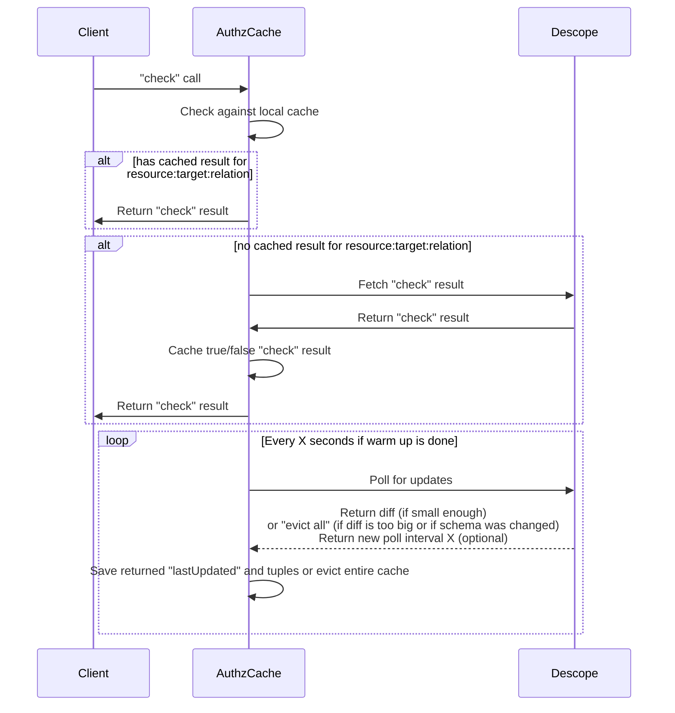

# Solution Goal and Assumptions
1. authz-cache will be deployed inside a client's cluster, which might not be open to inbound web traffic but must allow for external calls to descope
2. client will set an env flag to tell the descope SDK to communicate with authz-cache for "check" calls instead of going directly to descope servers. The supported protocols will be grpc & http (no need for https for in-cluster communication)
3. authz-cache should be kept as small and simple as possible since it must be re-deployed by clients for version upgrades.
4. the MVP version will hold the entire cache in memory, given that our largest client has "only" 1 million relations in the DB, which should fit in about 500MB of memory
5. a longer term solution might need to be more robust, with a capability to offload data to some SQLite style DB and with reduced latency which could be acheived by replacing the polling with some pub/sub solution.
# Overview Sequence Diagram

# "Lazy Load" (No Warmup) Design
1. Relations are cached lazily, on-demand, with no warm up call
2. Negative cache is also managed, i.e. we cache the fact that a relationship does *not* exist as well
3. The cache structure is therefore map between `resource:target:relationDef`->`bool`
4. Need to handle non-direct cache evicts, i.e. if a user is added to (or removed from) a group, and now their relations to many different resources have changed. Can we have the "diff" call return affected targets or resources that should be evicted? returning target:resource pairs might be very large, but perhaps if we only return the "target" the response will not be too big, even though it might remove more entitires from the cache.
# Cache Structure
1. Should match the "check" call, so it could be a set of keys structured like: `target:relationDefinition:resource`, e.g.: `user1:owner:file1`
2. If the cache does not contain a key, authz-cache can return `false` for the relation
# Changes in Descope AuthZ Service
1. Add polling endpoint for realtions and schema changes, which might return "affected targets" instead of directly returning "affected relations", and also return an "evict all" response in case the diff is too big or invloves breaking schema edits.
2. Add method (or understand) how to to track "lastUpdated" for relations, including "deletes" as well (might need to add "soft deletes")
    a. Look at the "change_events" table `authz_ce`
    b. Relations have `create_time` field
    c. For deletes, check if "soft deletes" should be enabled instead
3. Might need to add a method for fetching all schemas relevant to a certain project
4. Add an error handling endpoint