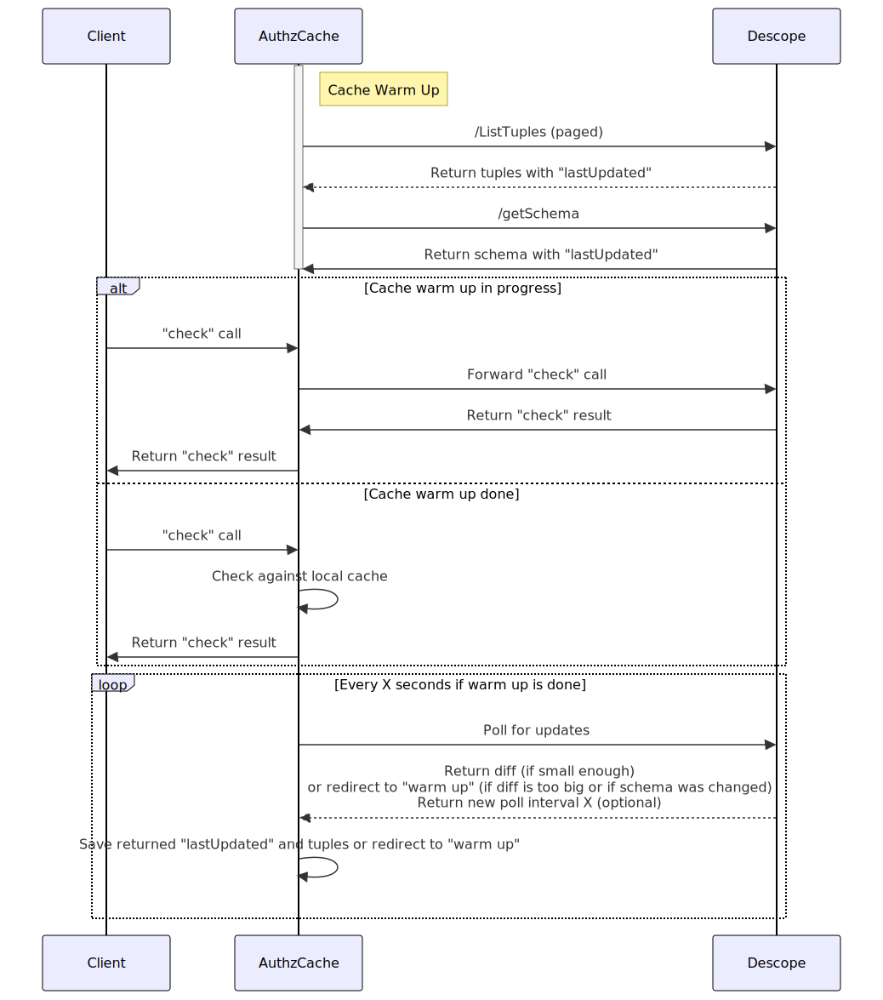

# Solution Goal and Assumptions
1. authz-cache will be deployed inside a client's cluster, which might not be open to inbound web traffic but must allow for external calls to descope
2. client will set an env flag to tell the descope SDK to communicate with authz-cache for "check" calls instead of going directly to descope servers. The supported protocols will be grpc & http (no need for https for in-cluster communication)
3. authz-cache should be kept as small and simple as possible since it must be re-deployed by clients for version upgrades.
4. the MVP version will hold the entire cache in memory, given that our largest client has "only" 1 million relations in the DB, which should fit in about 500MB of memory
5. a longer term solution might need to be more robust, with a capability to offload data to some SQLite style DB and with reduced latency which could be acheived by replacing the polling with some pub/sub solution.
# Cache Structure
1. Should match the "check" call, so it could be a set of keys structured like: `target:relationDefinition:resource`, e.g.: `user1:owner:file1`
2. If the cache does not contain a key, authz-cache can return `false` for the relation
# Cache Warm Up and Cache Invalidation
## Flow Diagram

## Additional Details and Explanations
1. Relevant project IDs can be defined via env variables
2. When auth-cache starts, it performs a "warm up", sending paged `/ListTuples` calls and a `/getSchema` call to descope to get all the relations and schemas in a project
3. During "warm up", any "check" calls received by authz-cache are immediatly forwarded to the descope servers, since the cache isn't yet ready for use
4. Once warm up is done, the `lastUpdated` time returned from descope is saved for the tuples and the schema
5. Once warm up is done, all "check" calls are checked against the local cache
6. auth-cache will poll descope once every X seconds, and descope will respond with either an empty diff, a diff of relations that were deleted/created, or a redirct to perform another "warm up" if the diff size will be over a certain threshold or if the schema was updated
7. descope can also respond with a new poll interval window size, to be able to dynamically adjust the load/latency pay-off
# 2nd Stage Cache Invalidations
1. The create/delete calls can also be routed via authz-cache to allow immediatly adding or invalidating relations before polling is doen, but that does not need to be part of the MVP.
# Errors Handling
1. If an error will be returned from auth-cache to the SDK, then the SDK will go directly to descope, sending the error details for internal logging
# Changes in Descope AuthZ Service
1. Add polling endpoint for realtions and schema changes
2. Add method (or understand) how to to track "lastUpdated" for relations, including "deletes" as well (might need to add "soft deletes")
    a. Look at the "change_events" table `authz_ce`
    b. Relations have `create_time` field
    c. For deletes, check if "soft deletes" should be enabled instead
3. Might need to add a method for fetching all schemas relevant to a certain project
4. Add an error handling endpoint