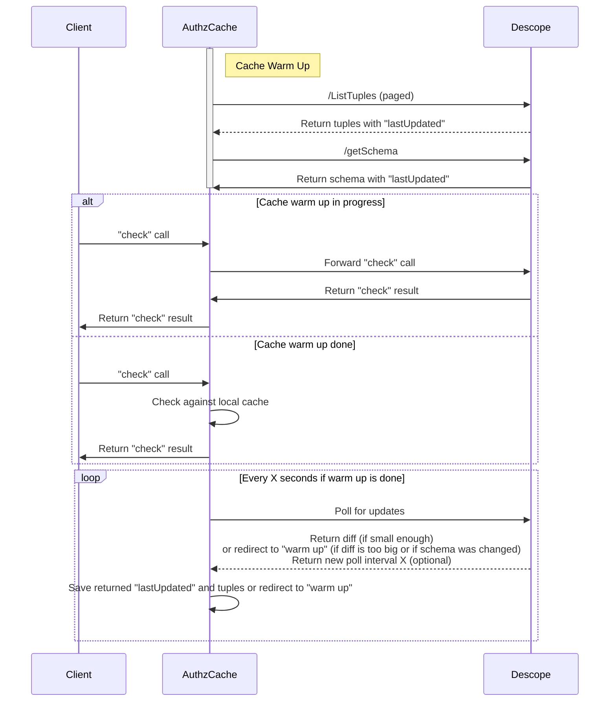

```mermaid
sequenceDiagram
    participant Client
    participant AuthzCache
    participant Descope

    activate AuthzCache 
    note right of AuthzCache: Cache Warm Up
    AuthzCache->>Descope: /ListTuples (paged)
    Descope-->>AuthzCache: Return tuples with "lastUpdated"
    AuthzCache->>Descope: /getSchema
    Descope->>AuthzCache: Return schema with "lastUpdated"
    deactivate AuthzCache

    alt Cache warm up in progress
    Client->>AuthzCache: "check" call
    AuthzCache->>Descope: Forward "check" call
    Descope->>AuthzCache: Return "check" result
    AuthzCache->>Client: Return "check" result

    else Cache warm up done
    Client->>AuthzCache: "check" call
    AuthzCache->>AuthzCache: Check against local cache
    AuthzCache->>Client: Return "check" result
    end

    loop Every X seconds if warm up is done
        AuthzCache->>Descope: Poll for updates
        Descope-->>AuthzCache: Return diff (if small enough) <br> or redirect to "warm up" (if diff is too big or if schema was changed) <br> Return new poll interval X (optional)
        AuthzCache->>AuthzCache: Save returned "lastUpdated" and tuples or redirect to "warm up"
    end
```